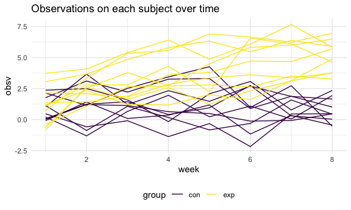
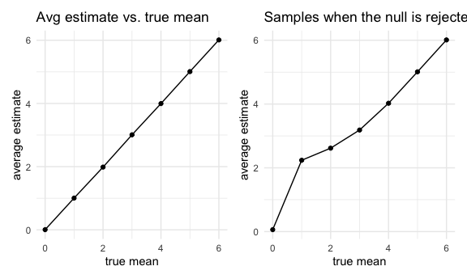

Homework 5
================
Chariz Seijo

## Problem 1

**Read in the data.**

``` r
homicide_df = 
  read_csv("data/homicide_data/homicide-data.csv") %>% 
  mutate(
    city_state = str_c(city, state, sep = "_"),
    resolved = case_when(
      disposition == "Closed without arrest" ~ "unsolved",
      disposition == "Open/No arrest"        ~ "unsolved",
      disposition == "Closed by arrest"      ~ "solved",
    )
  ) %>% 
  select(city_state, resolved) %>% 
  filter(city_state != "Tulsa_AL")
```

    ## Parsed with column specification:
    ## cols(
    ##   uid = col_character(),
    ##   reported_date = col_double(),
    ##   victim_last = col_character(),
    ##   victim_first = col_character(),
    ##   victim_race = col_character(),
    ##   victim_age = col_character(),
    ##   victim_sex = col_character(),
    ##   city = col_character(),
    ##   state = col_character(),
    ##   lat = col_double(),
    ##   lon = col_double(),
    ##   disposition = col_character()
    ## )

**Data exploration.**

``` r
aggregate_df = 
  homicide_df %>% 
  group_by(city_state) %>% 
  summarize(
    hom_total = n(),
    hom_unsolved = sum(resolved == "unsolved")
  )
```

    ## `summarise()` ungrouping output (override with `.groups` argument)

**Prop test for a single city.**

``` r
prop.test(
  aggregate_df %>% filter(city_state == "Baltimore_MD") %>% pull(hom_unsolved), 
  aggregate_df %>% filter(city_state == "Baltimore_MD") %>% pull(hom_total)) %>% 
  broom::tidy()
```

    ## # A tibble: 1 x 8
    ##   estimate statistic  p.value parameter conf.low conf.high method    alternative
    ##      <dbl>     <dbl>    <dbl>     <int>    <dbl>     <dbl> <chr>     <chr>      
    ## 1    0.646      239. 6.46e-54         1    0.628     0.663 1-sample… two.sided

**Iteration.**

``` r
results_df = 
  aggregate_df %>% 
  mutate(
    prop_tests = map2(.x = hom_unsolved, .y = hom_total, ~prop.test(x = .x, n = .y)),
    tidy_tests = map(.x = prop_tests, ~broom::tidy(.x))
  ) %>% 
  select(-prop_tests) %>% 
  unnest(tidy_tests) %>% 
  select(city_state, estimate, conf.low, conf.high)
```

``` r
results_df %>% 
  mutate(city_state = fct_reorder(city_state, estimate)) %>% 
  ggplot(aes(x = city_state, y = estimate)) +
  geom_point() + 
  geom_errorbar(aes(ymin = conf.low, ymax = conf.high)) + 
  theme(axis.text.x = element_text(angle = 90, vjust = 0.5, hjust = 1))
```


``` r
homicide_df = 
  read_csv("homicide_data/homicide-data.csv") %>% 
  mutate(
    city_state = str_c(city, state, sep = "_"),
    resolved = case_when(
      disposition == "Closed without arrest" ~ "unsolved",
      disposition == "Open/No arrest"        ~ "unsolved",
      disposition == "Closed by arrest"      ~ "solved",
    )
  ) %>% 
  select(city_state, resolved) %>% 
  filter(city_state != "Tulsa_AL") %>% 
  nest(data = resolved)
```

    ## Error: 'homicide_data/homicide-data.csv' does not exist in current working directory ('/Users/mogl/Desktop/Current Classes/Data Science/HW 5/p8105_hw5_cks2143').

## Problem 2

**Create a tidy dataframe of the longitudinal data.**

``` r
path_df = 
  tibble(
    path = list.files("data/lda_data")) %>% 
    mutate(path = str_c("data/lda_data/", path))

lda_tidydf = 
  tibble(
    id = path_df$path,
    map_df(.x = path_df$path, ~read_csv(.x))
    ) %>% 
  mutate(
    id = substr(id, 15, 20)
    ) %>% 
  separate(id, c("group", "id")) %>% 
  pivot_longer(
    week_1:week_8,
    names_to = "week",
    names_prefix = "week_",
    values_to = "obsv"
    ) %>% 
  mutate(
    id = as.numeric(id),
    week = as.numeric(week)
    )
```

**Spaghetti plot of observations.**

``` r
lda_tidydf %>% 
  ggplot(aes(x = week, y = obsv, group = interaction(id, group), color = group)) + 
    geom_line() +
    labs(title = "Observations on each subject over time")
```



Based on the spaghetti plot, we can observe that observation values for
the experimental group are generally higher than the control group. The
experimental group shows some increase in values over time while the
control group remains relatively stable.

## Problem 3

**Create and run simulation.**

``` r
sim_ttest = 
  function(n = 30, mu, sigma = 5) {
    
      sim_data = 
        tibble(
          x = rnorm(n = 30, mean = mu, sd = sigma)
        )
      
sim_data %>% 
  t.test() %>% 
  broom::tidy() %>% 
  select(estimate, p.value)
  }

sim_results = 
  tibble(mu = c(0,1,2,3,4,5,6)) %>%
  mutate(
    output_lists = map(.x = mu, ~ rerun(5000, sim_ttest(n = 30, mu = .x))),
    estimate_df = map(output_lists, bind_rows)
    ) %>%
  select(-output_lists) %>% 
  unnest(estimate_df) %>% 
  mutate(decision = ifelse(p.value<0.05, "reject", "fail to reject"))
```

**Plot showing the proportion of times the null was rejected.**

``` r
plot_power =
  sim_results %>% 
  group_by(mu) %>%
  summarise(
    n = n(),
    reject = sum(p.value < 0.05)/n) %>% 
  ggplot(aes(x = mu, y = reject)) +
  geom_point() +
  geom_smooth(se = FALSE) +
  labs(
    x = "effect size",
    y = "power"
  )

plot_power
```


Based on this plot, we can observe that as effect size increases, power
(proportion of times null was rejected) increases.

**Plot showing the average estimate of μ̂ on the y axis and the true
value of μ on the x axis.**

``` r
plot_1 =
  sim_results %>% 
  group_by(mu) %>% 
  summarise(avg_estimate = mean(estimate)) %>% 
  ggplot(aes(x = mu, y = avg_estimate)) +
  geom_point() +
  geom_line() +
    labs(
    x = "true mean",
    y = "average estimate",
    title = "Avg estimate vs. true mean"
  ) 
```

**Plot showing the average estimate of μ̂ only in samples for which the
null was rejected on the y axis and the true value of μ on the x axis.**

``` r
plot_2 =
  sim_results %>% 
  group_by(mu) %>%
  filter(decision == "reject") %>%
  summarise(
    avg_estimate = mean(estimate)) %>% 
  ggplot(aes(x = mu, avg_estimate)) +
  geom_point() +
  geom_line() +
  labs(x = "true mean",
       y = "average estimate",
       title = "Samples when the null is rejected")

plot_1 + plot_2
```



For all samples, the average estimate of the mean is equal to the true
mean.

When the null is rejected, the average estimates of the mean are higher
than the true mean is \>0 and \<4. The estimates become equal to the
true mean when it is 4 or greater. This is likely because as power
increases, the average estimate of the mean gets closer to the true mean
among the samples when the null hypothesis is rejected.
